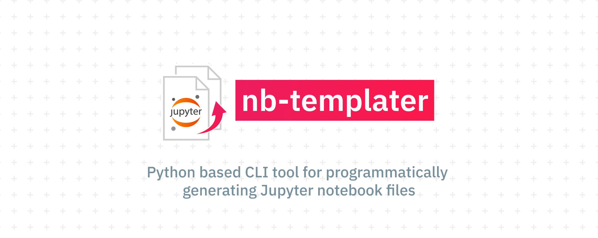
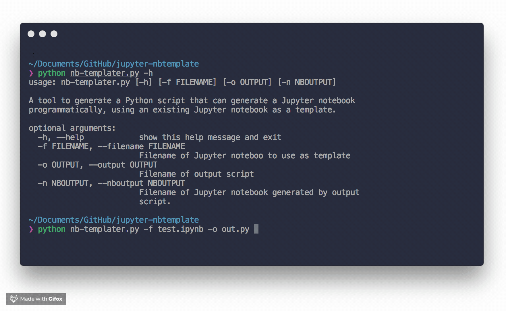

[](https://github.com/ismailuddin/jupyter-nb-templater/issues)



A command line tool to generate a Python script, which programmatically generates Jupyter notebooks, using a Jupyter notebook as a template starting point.

Particularly useful for projects where you need to generate many similar Jupyter notebooks in different directories, which differ only by a few lines e.g. the file which they import.

The intention of this script is to speed up the process of programmatically generating Jupyter notebooks, by providing a script template, which you can further customise downstream.

## Requirements
* Python 3.X 
* nbformat


## Installation
First clone the repo

```bash
$  git clone https://github.com/ismailuddin/jupyter-nb-templater.git
```

Then install using

```bash
$  python setup.py install
```


## Usage
To generate a Python script to programmatically generate a Jupyter notebook, first run `nb-templater` on the template Jupyter notebook file:

```shell
$  nb-templater -f input.ipynb -o output_script.py [ -n output.ipynb ]
```

### Arguments
`-f`      Input filename of the Jupyter notebook to use as a template

`-o`      Output filename of the Python script used to generate the notebook

`-n`      (Optional) The output filename of the Jupyter notebook generated by the script

Once the script has been generated, you can edit this file to customise the cells. For example, you may have a variable name in a cell of the notebook, which you substitute with an argument you provide to the script.

The generated Jupyter notebooks will not have been 'executed' by default. Using a shell script, you can execute this scripts from the command line with the following command:

```shell
$  jupyter nbconvert --execute --inplace "input.ipynb"
```

Covered in a bit more detail in my blog [post](https:/ismailuddin.github.io/python/general/2018/09/30/Jupyter-nbtemplater.html).

## Example outputs
The `examples/` directory contains an example of the input Jupyter notebook file, and the output files generated by the scripts.

## Limitations
* Only supports converting notebook cells that either markdown or code. 

